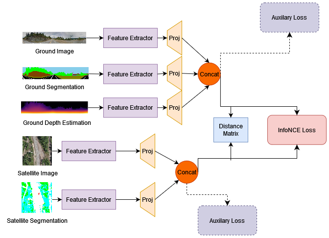
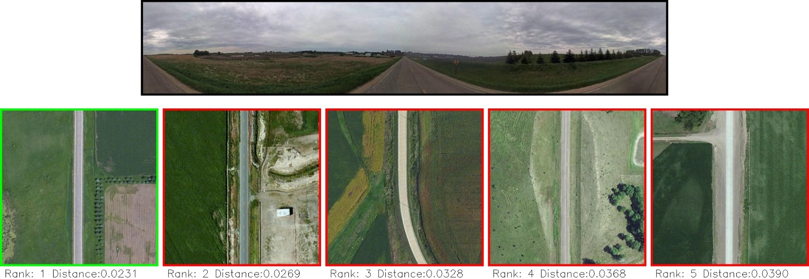
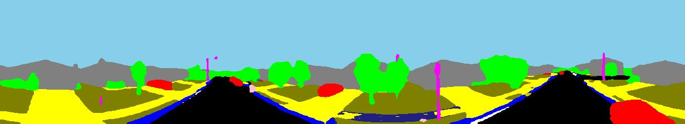
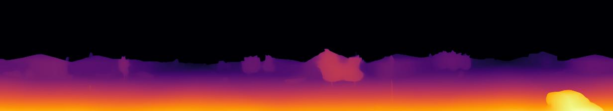

# Computer-Vision
The task of Ground-to-Aerial matching caught our attention for several reasons.

Primarily, we were intrigued to delve into our first work in the field of Information Retrieval and multi-view and cross-domain image analysis. The prospect of addressing a novel challenge within this domain was exciting and offered the opportunity to contribute meaningfully to the development of new methodologies and technologies.

Additionally, the challenge of matching a ground image to the correct satellite image without any spatial information (such as coordinates where the picture was taken) presented a fascinating problem. The complexity of this problem lies in the significant differences in scale, angle, and appearance between ground-level and aerial images, necessitating advanced algorithms and innovative approaches to bridge the gap.

Following the feature-enrichment approach of the paper "A Semantic Segmentation-guided Approach for Ground-to-Aerial Image Matching", we present an enriched dataset, starting from a subset of the CVUSA dataset, and new models combining brand new features (such as Ground Depth estimation and Ground Semantic Segmentation), with the ones presented in the paper.

As backbone models for our "branches" we used most of the state of the art models, in particular VGG16, ResNet (in the 50, 101 and 152 versions) and SAIG, a transformer-based model for dealing that proved to be quite effective.

*Figure: Quintuple Model - combines all features.*

The generation of the new features was done in two different Colab notebooks:

- Ground Depth Estimation (GroundDepthMap)
- Ground Semantic Segmentation (GroundSemantic2)

Everything was done using Pytorch Lightning in the Google Colab environment.

Everything is available in the CVUSA.ipynb file.

*Figure: Example match image.*

*Figure: Example Ground Segmentation image.*

*Figure: Example Ground Depth Estimation image.*

Enriched Dataset available at: https://drive.google.com/file/d/11DR7zhd6wchdyt8DSkTY2JGgf_jrtf1D
